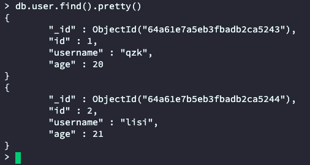

# MongoDB安装及基础

## 1. mongodb的安装

1). 拉取镜像

```sh
docker pull mongo:4.4
```

2). 创建数据挂载目录

```sh
mkdir -p /home/mongodb/data
mkdir -p /home/mongodb/log
mkdir -p /home/mongodb/conf
```

3). 创建配置文件 `/home/mongodb/conf/mongo.conf`如下

```yml
net:
	# 端口
  port: 27017
  # 访问IP
  bindIp: 0.0.0.0
  # 最大同时连接数
  maxIncomingConnections: 100
security:
  # 用户验证
  authorization: enabled
storage:
  # 数据文件
  dbPath: /data/db
  journal:
    enabled: true
  # 存储引擎有mmapv1、wiredTiger、mongorocks
  engine: wiredTiger
```

4). 创建容器运行

```sh
docker run -d -p 27017:27017 \
-v /home/mongodb/data:/data/db \
-v /home/mongodb/conf:/data/configdb \
--name mongo mongo:4.4 \
--config /data/configdb/mongo.conf
```

4). 进入容器，创建账号

```sh
docker exec -it 容器id bash
```

5). 使用mongo命令行添加账号

```sh
mongo
```

```mongo
use admin
```

```mongo
# 创建用户 root，密码为 root 角色为 root
db.createUser({user:"root",pwd:"root",roles:["root"]})
```

6). 登陆验证

```mongo
db.auth("root","root")
```

## 2. 相关概念

### 2.1 基础

|     SQL     |    Mongo    |         SQL/Mongo说明          |
| :---------: | :---------: | :----------------------------: |
|  database   |  database   |             数据库             |
|    table    | collection  |         数据库表/集合          |
|     row     |  document   |        数据记录行/文档         |
|   column    |    field    |          数据字段/域           |
|    index    |    index    |              索引              |
| primary key | primary key | 主键，mongo中自动将_id作为主键 |

## 3. 基本操作

### 3.1 数据库相关操作

```sh
# 查看所有的数据库
> show dbs
admin   0.000GB
config  0.000GB
local   0.000GB

# 通过use关键字切换数据库
> use admin
switched to db admin


# 创建数据库
# 说明：在MongoDB中，数据库是自动创建的，通过use切换到新数据库中，进行插入数据即可自动创建数据库
> use testdb
switched to db testdb


#并没有创建数据库
> show dbs 
admin 0.000GB
config 0.000GB
local 0.000GB

# 插入数据
> db.user.insert({id:1,name:'zhangsan'}) 
WriteResult({ "nInserted" : 1 })

# 数据库自动创建
> show dbs
admin 0.000GB
config 0.000GB
local 0.000GB
testdb 0.000GB

# 查看集合
> show collections
user


# 删除集合
> db.user.drop()
true #如果成功删除选定集合，则 drop() 方法返回 true，否则返回 false。


# 删除数据库
> use testdb #先切换到要删除的数据中
switched to db testdb
# 删除数据库
> db.dropDatabase() 
{ "dropped" : "testdb", "ok" : 1 }
> show dbs
admin 0.000GB
config 0.000GB
local 0.000GB

```
### 3.2 数据操作
#### 增

> **语法：**
>
> ```sh
> db.COLLECTION_NAME.insert(document)
> ```
>
> 在MongoDB中，存储的文档结构是一种类似于json的结构，称之为bson（全称为：Binary JSON）。

```sh
# 插入数据
> db.user.insert({id:1,username:'zhangsan',age:20})
WriteResult({ "nInserted" : 1 })
> db.user.save({id:2,username:'lisi',age:25})
WriteResult({ "nInserted" : 1 })


# 查询数据
> db.user.find() 
{ "_id" : ObjectId("5c08c0024b318926e0c1f6dc"), "id" : 1, "username" : "zhangsan",
"age" : 20 }
{ "_id" : ObjectId("5c08c0134b318926e0c1f6dd"), "id" : 2, "username" : "lisi",
"age" : 25 }
```


#### 删

> **语法：**
>
> ```sh
> db.collection.remove(
> <query>,
> 	{
>     justOne: <boolean>,
>     writeConcern: <document>
> 	}
> )
> ```
>
> **参数说明：**
>
> - **query** :（可选）删除的文档的条件。
> - **justOne** : （可选）如果设为 true 或 1，则只删除一个文档，如果不设置该参数，或使用默认值 false，则删除所有匹配条件的文档。
> - **writeConcern** :（可选）抛出异常的级别。

```sh
> db.user.remove({age:25})
WriteResult({ "nRemoved" : 2 }) #删除了2条数据
#插入4条测试数据
db.user.insert({id:1,username:'zhangsan',age:20})
db.user.insert({id:2,username:'lisi',age:21})
db.user.insert({id:3,username:'wangwu',age:22})
db.user.insert({id:4,username:'zhaoliu',age:22})

> db.user.remove({age:22},true)
WriteResult({ "nRemoved" : 1 }) #删除了1条数据
#删除所有数据
> db.user.remove({})
#说明：为了简化操作，官方推荐使用deleteOne()与deleteMany()进行删除数据操作。
db.user.deleteOne({id:1})
db.user.deleteMany({}) #删除所有数据
```


#### 改

> **语法：**
>
> ```
> db.collection.update(
>   <query>,
>   <update>,
>   [
>     upsert: <boolean>,
>     multi: <boolean>,
>     writeConcern: <document>
>   ]
> )
> ```
>
> **参数说明：**
>
> - **query** : update的查询条件，类似sql update查询内where后面的。
> - **update** : update的对象和一些更新的操作符（如inc...）等，也可以理解为sql update查询内set后面的
> - **upsert** : 可选，这个参数的意思是，如果不存在update的记录，是否插入objNew,true为插入，默认是false，不插入。
> - **multi** : 可选，mongodb 默认是false,只更新找到的第一条记录，如果这个参数为true,就把按条件查出来多条记录全部更新。
> - **writeConcern** :可选，抛出异常的级别。

```sh
# 查看更新后
> db.user.find()
{ "_id" : ObjectId("5c08c0024b318926e0c1f6dc"), "id" : 1, "username" : "zhangsan",
"age" : 20 }
{ "_id" : ObjectId("5c08c0134b318926e0c1f6dd"), "id" : 2, "username" : "lisi",
"age" : 25 }

# 更新数据
> db.user.update({id:1},{$set:{age:22}}) 
WriteResult({ "nMatched" : 1, "nUpserted" : 0, "nModified" : 1 })

# 查看更新前
> db.user.find()
{ "_id" : ObjectId("5c08c0024b318926e0c1f6dc"), "id" : 1, "username" : "zhangsan",
"age" : 22 }
{ "_id" : ObjectId("5c08c0134b318926e0c1f6dd"), "id" : 2, "username" : "lisi",
"age" : 25 }

# 注意：如果这样写，会删除掉其他的字段
> db.user.update({id:1},{age:25})
WriteResult({ "nMatched" : 1, "nUpserted" : 0, "nModified" : 1 })
> db.user.find()
{ "_id" : ObjectId("5c08c0024b318926e0c1f6dc"), "age" : 25 }
{ "_id" : ObjectId("5c08c0134b318926e0c1f6dd"), "id" : 2, "username" : "lisi",
"age" : 25 }
# 更新不存在的字段，会新增字段
> db.user.update({id:2},{$set:{sex:1}}) #更新数据
# 查看更新后
> db.user.find()
{ "_id" : ObjectId("5c08c0024b318926e0c1f6dc"), "age" : 25 }
{ "_id" : ObjectId("5c08c0134b318926e0c1f6dd"), "id" : 2, "username" : "lisi",
"age" : 25, "sex" : 1 }

#更新不存在的数据，默认不会新增数据
> db.user.update({id:3},{$set:{sex:1}})
WriteResult({ "nMatched" : 0, "nUpserted" : 0, "nModified" : 0 })
> db.user.find()
{ "_id" : ObjectId("5c08c0024b318926e0c1f6dc"), "age" : 25 }
{ "_id" : ObjectId("5c08c0134b318926e0c1f6dd"), "id" : 2, "username" : "lisi",
"age" : 25, "sex" : 1 }

# 如果设置第一个参数为true，就是新增数据
> db.user.update({id:3},{$set:{sex:1}},true)
WriteResult({
"nMatched" : 0,
"nUpserted" : 1,
"nModified" : 0,
"_id" : ObjectId("5c08cb281418d073246bc642")
})
# 查看更新后
> db.user.find()
{ "_id" : ObjectId("5c08c0024b318926e0c1f6dc"), "age" : 25 }
{ "_id" : ObjectId("5c08c0134b318926e0c1f6dd"), "id" : 2, "username" : "lisi",
"age" : 25, "sex" : 1 }
{ "_id" : ObjectId("5c08cb281418d073246bc642"), "id" : 3, "sex" : 1 }
```


#### 查

> **语法**：
>
> ```sh
> db.collection.find([query],[fields])
> ```
>
> **参数说名：**
>
> - query ：可选，使用查询操作符指定查询条件
> - fields ：可选，使用投影操作符指定返回的键。查询时返回文档中所有键值， 只需省略该参数即可（默认省略）。

*`db.col.find().pretty()`格式化查询*



> **条件查询**

|       操作        |           格式           |               示例                |       对应SQL        |
| :---------------: | :----------------------: | :-------------------------------: | :------------------: |
|    等于（ = ）    |    `{<key>:<value> }`    |  `db.user.find({"name":"qzk"})`   | `where name = 'qzk'` |
|    小于（ < ）    | `{<key>:{$lt:<value>}}`  | `db.user.find({"age":{$lt:20}})`  |   `where age < 20`   |
| 小于或等于 ( <= ) | `{<key>:{$lte:<value>}}` | `db.user.find({"age":{$lte:20}})` |  `where age <= 20`   |
|    大于 ( > )     | `{<key>:{$gt:<value>}}`  | `db.user.find({"age":{$gt:20}})`  |   `where age > 20`   |
| 大于或等于 ( >= ) | `{<key>:{$gte:<value>}}` | `db.user.find({"age":{$gte:20}})` |  `where age >= 20`   |
|   不等于 ( != )   | `{<key>:{$ne:<value>}}`  | `db.user.find({"age":{$ne:20}})`  |  `where age != 20`   |

```sh
# 插入测试数据
db.user.insert({id:1,username:'zhangsan',age:20})
db.user.insert({id:2,username:'lisi',age:21})
db.user.insert({id:3,username:'wangwu',age:22})
db.user.insert({id:4,username:'zhaoliu',age:22})


# 只查询id与username字段
db.user.find({},{id:1,username:1}) 


# 查询数据条数
db.user.find().count() 


# 查询id为1的数据
db.user.find({id:1}) 


# 查询小于等于21的数据
db.user.find({age:{$lte:21}})


# and查询，age小于等于21并且id大于等于2
db.user.find({age:{$lte:21}, id:{$gte:2}}) 


# 查询id=1 or id=2
db.user.find({$or:[{id:1},{id:2}]})


# 分页查询：Skip()跳过几条，limit()查询条数
db.user.find().limit(2).skip(1) #跳过1条数据，查询2条数据


# 按照age倒序排序，-1为倒序，1为正序
db.user.find().sort({id:-1}) 
```


## 4.  索引和索引操作

### 4.1 索引

索引通常能够极大的提高查询的效率，如果没有索引，MongoDB在读取数据时必须扫描集合中的每个文件并选取那些符合查询条件的记录。

索引是特殊的数据结构，索引存储在一个易于遍历读取的数据集合中，索引是对数据库表中一列或多列的值进行排序的一种结构。

### 4.2 索引操作

```sh
# 查看索引示例
> db.user.getIndexes()
[ { "v" : 2, "key" : { "_id" : 1 }, "name" : "_id_" } ] # v:版本号  key：索引字段 1 表示升序   name：索引名
```


```sh
# 示例
> db.user.createIndex({'age':1})
{
  "createdCollectionAutomatically" : false,
  "numIndexesBefore" : 1,
  "numIndexesAfter" : 2,
  "ok" : 1
}
```


```sh
# 删除索引示例
db.user.dropIndex("age_1")
# 删除除了_id之外的索引
db.user.dropIndexes()
```


```sh
# 创建联合索引
db.user.createIndex({'age':1, 'id':-1})
```


```sh
# 查看索引大小，单位：字节
db.user.totalIndexSize()
```


## 5. 整合spring

### 1. 环境准备

**引入依赖**

```xml
 <!-- mongodb-starter -->
 <dependency>
     <groupId>org.springframework.boot</groupId>
     <artifactId>spring-boot-starter-data-mongodb</artifactId>
 </dependency>
 <!-- spring-test -->
 <dependency>
     <groupId>org.springframework.boot</groupId>
     <artifactId>spring-boot-starter-test</artifactId>
     <scope>test</scope>
 </dependency>
```

**mongodb配置**

```yml
spring:
  data:
    mongodb:
      username: root
      password: root
      authentication-database: admin
      host: 43.142.63.121
      port: 27017
      database: testdb
```

### 2. MongoTemplate使用

#### 增

```java
/**
 * 插入文档示例
 */
public void savePerson(Person person) {
    // 默认不传递 collectionName 将会使用参数的类名首字母小写作为collection的名字
    this.mongoTemplate.save(person);
}

/**
 * 批量插入示例
 */
public void saveBatchPerson(List<Person> list) {
    this.mongoTemplate.insertAll(list);
}
```

#### 删

```java
/**
 * 按id删除
 */
public DeleteResult deleteById(String id) {
    Query query = Query.query(Criteria.where("id").is(id));
    return this.mongoTemplate.remove(query, Person.class);
}
```


#### 改

```java
/**
 * 修改年龄示例
 */
public UpdateResult updateAge(Person person) {
    Query query = Query.query(Criteria.where("id").is(person.getId()));
    Update update = Update.update("age", person.getAge());
    return this.mongoTemplate.updateFirst(query, update, Person.class);
}
```


#### 查

```java
/**
 * 按名字查询Person示例
 */
public List<Person> queryPersonListByName(String name) {
    Query query = new Query(Criteria.where("name").is(name));
    return this.mongoTemplate.find(query, Person.class);
}

/**
 * 分页查询示例
 */
public List<Person> queryPersonListPage(Integer page, Integer rows) {
    Query query = new Query().limit(rows).skip((page - 1) * rows);
    return this.mongoTemplate.find(query, Person.class);
}
```

